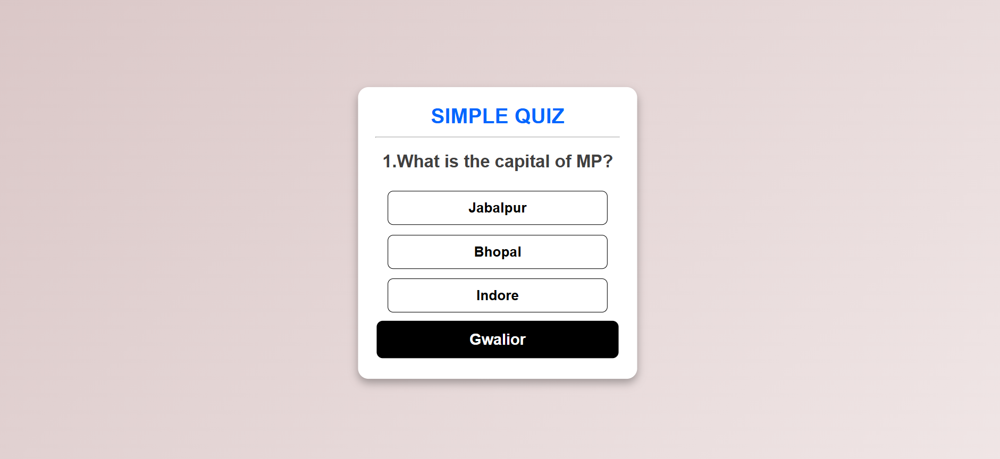

# Simple Quiz App

A simple and interactive quiz application built using **HTML, CSS, and JavaScript**. This project dynamically displays multiple-choice questions and tracks the user's score.

## Features

- 📌 Displays multiple-choice questions dynamically.
- 🎨 Responsive and clean UI design.
- ✅ Highlights correct and incorrect answers.
- 🔄 Tracks score and allows replaying the quiz.
- 🔥 Smooth button animations and hover effects.

## Technologies Used

- **HTML** - Structuring the web page.
- **CSS** - Styling and responsive design.
- **JavaScript** - Logic for handling questions, answers, and scoring.

## How to Use

1. Clone this repository:  
https://github.com/sapeksh123/Quiz-app.git

2. Open `quiz.html` in your browser.
3. Click on an answer to select it.
4. Click the "Next" button to move to the next question.
5. See your score at the end and restart the quiz if you want.

## File Structure
/quiz-app │-- quiz.html # Main HTML file │-- quiz.css # Styling file │-- quiz.js # JavaScript logic │-- README.md # Project documentation

## Demo

  

## Contributing

Feel free to fork the repository and submit pull requests! Suggestions and improvements are welcome. 🚀

## License

This project is **free to use** and does not require any licensing.

---

Happy coding! 💻🎯
